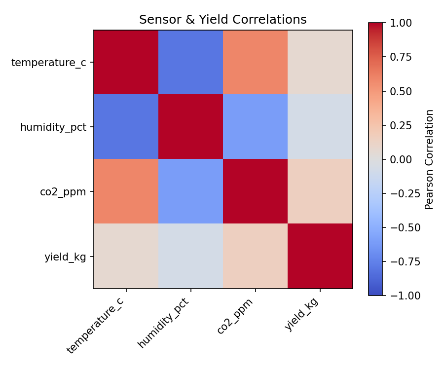
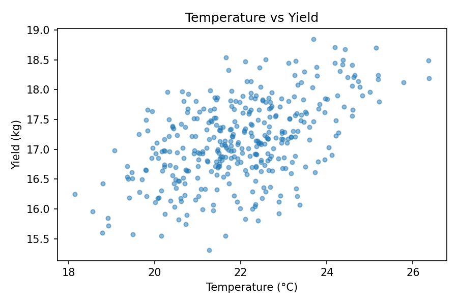
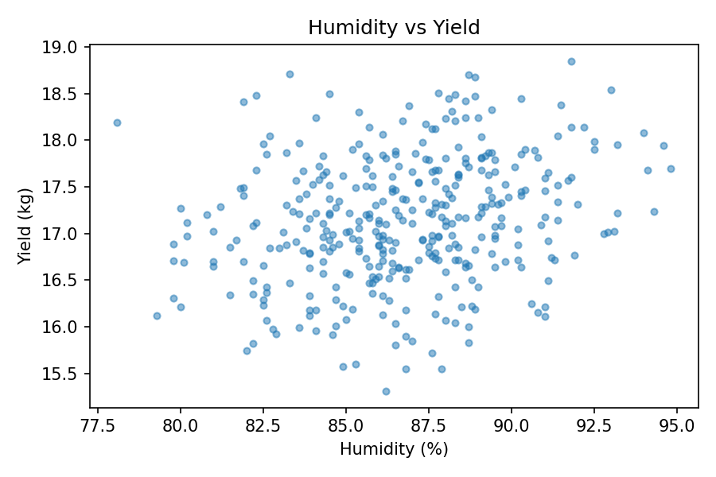
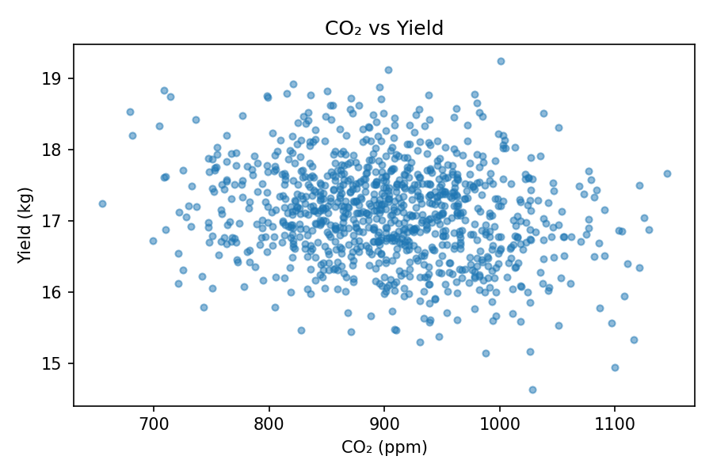
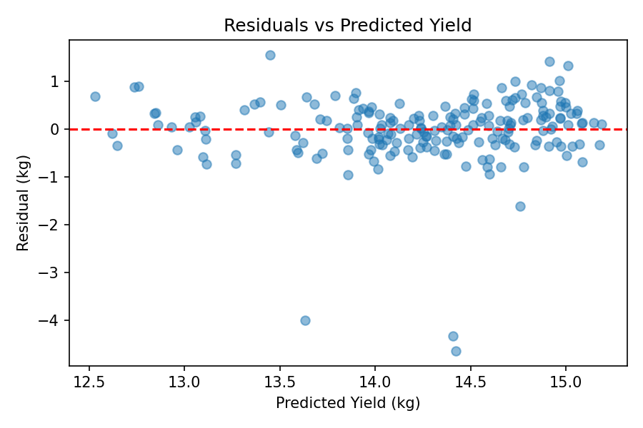
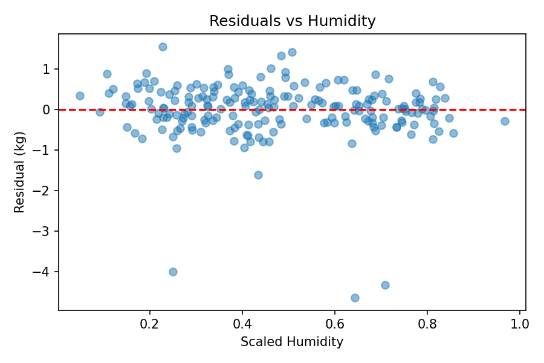
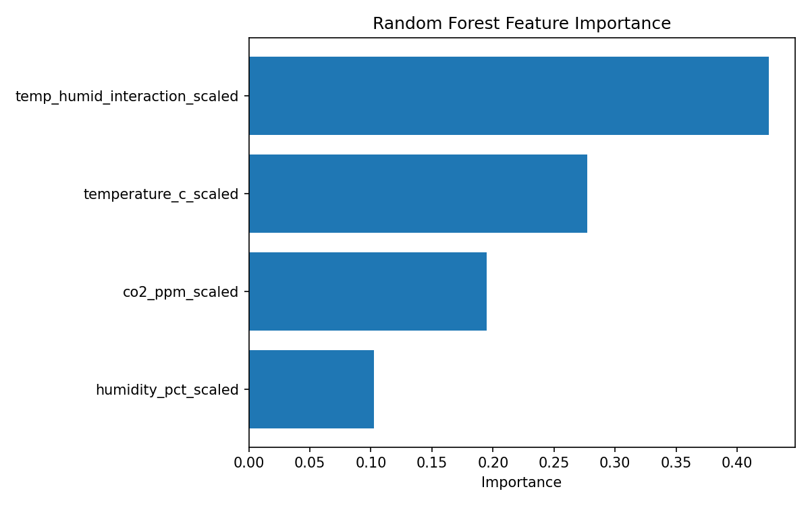
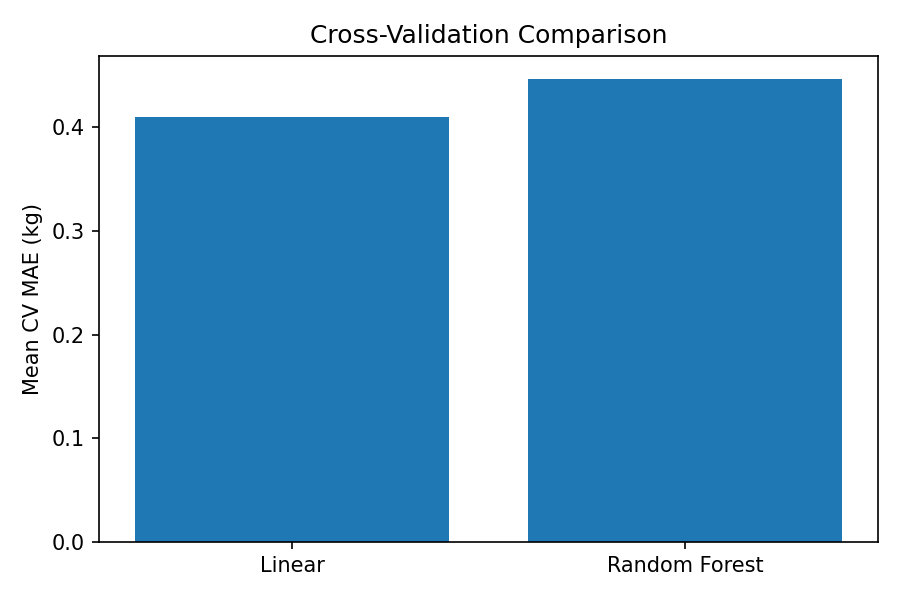
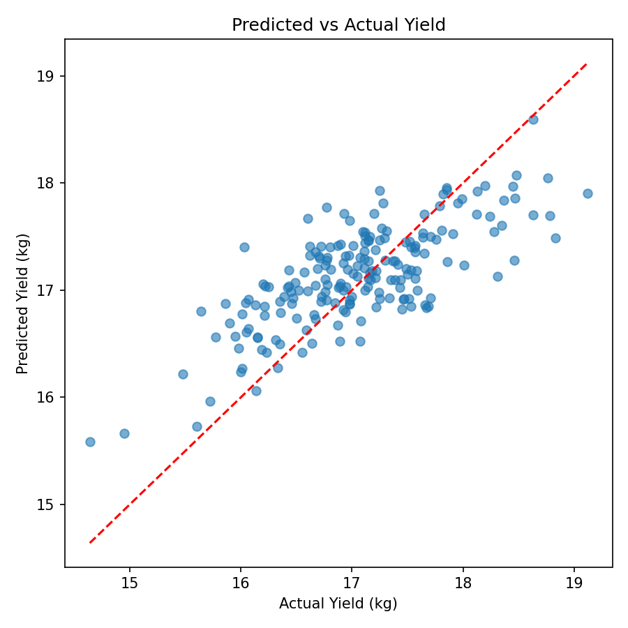

# Mushroom Yield Forecast Project – Technical Report

## Executive Summary

This project developed a machine learning pipeline to predict daily mushroom yield (kg) in a climate-controlled polyhouse using environmental sensor readings. Temperature (°C), humidity (%), and CO₂ concentration (ppm) data collected between January 2023 and September 2025 were used to train predictive models.

Three models were evaluated: Linear Regression, Random Forest Regression, and a Tuned Random Forest Regression model. Model performance was assessed using a temporal train-test split and TimeSeriesSplit cross-validation to reflect real-world forecasting conditions.

The final production model was Linear Regression, which achieved the strongest overall performance while remaining simple, interpretable, and computationally efficient.

Final test performance:

| Metric | Value    |
| ------ | -------- |
| MAE    | 0.412 kg |
| RMSE   | 0.508 kg |
| R²     | 0.525    |

A Streamlit dashboard was developed for interactive forecasting, and prediction logging and monitoring plans were implemented to support deployment and future maintenance.

---

# 1. Problem Statement

Mushroom cultivation is highly sensitive to environmental conditions. Small changes in temperature, humidity, or CO₂ concentration can significantly influence daily yield.

The objective of this project was to build a machine learning system capable of estimating daily mushroom yield using environmental sensor measurements collected from a climate-controlled polyhouse.

Potential benefits include:

* Improved production planning
* Better environmental control decisions
* Reduced yield uncertainty
* Support for precision agriculture practices

---

# 2. Dataset Description

The dataset consisted of polyhouse sensor observations collected from January 2023 through September 2025.

Variables included:

| Variable          | Unit |
| ----------------- | ---- |
| Temperature       | °C   |
| Humidity          | %    |
| CO₂ Concentration | ppm  |
| Yield             | kg   |

The target variable was daily mushroom yield measured in kilograms.

## Initial Dataset Statistics

| Metric         | Value |
| -------------- | ----- |
| Rows           | 1,010 |
| Columns        | 5     |
| Duplicate Rows | 10    |

## Missing Values Before Cleaning

| Variable    | Missing Values |
| ----------- | -------------- |
| Temperature | 50             |
| Humidity    | 50             |
| CO₂         | 51             |
| Yield       | 0              |

---

# 3. Data Cleaning

Several preprocessing steps were performed before modeling.

## Cleaning Steps

* Removed duplicate timestamps
* Imputed or corrected missing sensor values
* Detected and removed outliers
* Verified numeric sensor ranges
* Standardized data types
* Validated dataset consistency

## Cleaning Results

| Metric                       | Value |
| ---------------------------- | ----- |
| Original Rows                | 1,010 |
| Final Rows                   | 980   |
| Rows Removed                 | 30    |
| Percentage Removed           | 2.97% |
| Duplicate Timestamps Removed | 10    |
| Outliers Removed             | 19    |

The final cleaned dataset contained no missing values.

---

# 4. Exploratory Data Analysis

Exploratory Data Analysis (EDA) was performed to understand relationships between environmental variables and mushroom yield.

Key observations included:

* Temperature, humidity, and CO₂ all showed measurable relationships with yield.
* Environmental variables exhibited moderate correlations.
* Yield variation across environmental conditions suggested predictive potential.
* Several nonlinear relationships were visible, motivating evaluation of both linear and tree-based models.

## Correlation Analysis



**Figure 1.** Correlation matrix of environmental variables and mushroom yield.

## Temperature and Yield



**Figure 2.** Relationship between temperature (°C) and mushroom yield (kg).

## Humidity and Yield



**Figure 3.** Relationship between humidity (%) and mushroom yield (kg).

## CO₂ and Yield



**Figure 4.** Relationship between CO₂ concentration (ppm) and mushroom yield (kg).

---

# 5. Feature Engineering and Validation Strategy

## Feature Engineering

A new interaction feature was created to capture combined environmental effects:

Temperature × Humidity

The following features were used:

* Temperature
* Humidity
* CO₂
* Temperature-Humidity Interaction

Min-Max scaling was applied before model training.

Final feature count: 4

## Validation Strategy

Because observations were time-dependent, a temporal train-test split was used instead of random splitting.

This approach better reflects real-world forecasting scenarios and reduces information leakage from future observations.

### Train Period

2023-01-01 → 2025-03-12

### Test Period

2025-03-13 → 2025-09-26

### Dataset Sizes

| Dataset  | Rows |
| -------- | ---- |
| Training | 784  |
| Testing  | 196  |

TimeSeriesSplit cross-validation was also performed during model evaluation.

---

# 6. Models Evaluated

Three models were evaluated.

## Linear Regression

Advantages:

* Simple and interpretable
* Fast training and inference
* Easy deployment
* Low computational requirements

### Residual Analysis



**Figure 5.** Residuals plotted against predicted yield values.



**Figure 6.** Residuals plotted against humidity values.

### Test Performance

| Metric | Value    |
| ------ | -------- |
| MAE    | 0.412 kg |
| RMSE   | 0.508 kg |
| R²     | 0.525    |

### Feature Coefficients

| Feature                          | Coefficient |
| -------------------------------- | ----------- |
| Temperature                      | 3.2648      |
| Humidity                         | 1.0778      |
| CO₂                              | -0.8207     |
| Temperature-Humidity Interaction | -0.9381     |

---

## Random Forest Regression

Advantages:

* Captures nonlinear relationships
* Handles feature interactions automatically
* Robust to noise

### Test Performance

| Metric | Value    |
| ------ | -------- |
| MAE    | 0.447 kg |
| RMSE   | 0.544 kg |
| R²     | 0.453    |

---

## Tuned Random Forest Regression

Grid Search Cross Validation was used to optimize hyperparameters.

### Best Parameters

| Parameter        | Value |
| ---------------- | ----- |
| n_estimators     | 200   |
| max_depth        | 5     |
| min_samples_leaf | 3     |

### Best Cross Validation MAE

0.426

### Test Performance

| Metric | Value    |
| ------ | -------- |
| MAE    | 0.430 kg |
| RMSE   | 0.523 kg |
| R²     | 0.496    |

### Feature Importance



**Figure 7.** Feature importance scores from the tuned Random Forest model.

---

# 7. Cross Validation Results

TimeSeriesSplit cross-validation was used to estimate model generalization performance.

| Model             | Mean CV MAE | Std CV MAE |
| ----------------- | ----------- | ---------- |
| Linear Regression | 0.410       | 0.024      |
| Random Forest     | 0.447       | 0.025      |



**Figure 8.** Mean cross-validation MAE comparison across evaluated models.

---

# 8. Results and Champion Model Selection

## Model Comparison

| Model               | MAE (kg) | RMSE (kg) | R²    |
| ------------------- | -------- | --------- | ----- |
| Linear Regression   | 0.412    | 0.508     | 0.525 |
| Random Forest       | 0.447    | 0.544     | 0.453 |
| Tuned Random Forest | 0.430    | 0.523     | 0.496 |

## Metric Definitions

**MAE (Mean Absolute Error)** measures average prediction error in kilograms.

**RMSE (Root Mean Squared Error)** penalizes larger prediction errors more heavily.

**R² Score** measures how much variation in mushroom yield is explained by the model.

## Champion Model

Linear Regression was selected as the production model because it achieved:

* Lowest test MAE
* Lowest test RMSE
* Highest R² score
* Highest interpretability
* Simplest deployment pipeline

### Actual vs Predicted Performance



**Figure 9.** Actual versus predicted yield for the Linear Regression model.

---

# 9. Deployment

A Streamlit application was developed to provide interactive yield forecasting.

Dashboard features include:

* Temperature input
* Humidity input
* CO₂ input
* Yield prediction display
* Humidity sensitivity chart
* Model information panel
* Forecast confidence section
* Out-of-range input warnings

## Local Launch

```bash
streamlit run app.py
```

## Deployment URL

https://mushroom-yield-forecast-yuyw8tbwilapps8umkaafac.streamlit.app/

---

# 10. Monitoring and Maintenance

Prediction logging was implemented to support monitoring and auditing.

Logged fields include:

* timestamp_utc
* temp_c
* humidity_pct
* co2_ppm
* predicted_kg

## Drift Monitoring

Potential drift scenarios include:

* Sensor recalibration changes
* Seasonal environmental shifts
* Changes in cultivation practices
* New substrate batches
* Changes in greenhouse management strategies

## Retraining Triggers

Model retraining is recommended when:

* MAE increases by more than 20%
* Input distributions shift significantly
* New seasonal data becomes available
* Sensor hardware changes occur

---

# 11. Limitations

Several limitations should be considered.

* Dataset size remains relatively small.
* Only three environmental variables were available.
* Substrate quality was not included.
* Harvesting practices were not included.
* Predictions may degrade outside the observed training range.
* The model assumes historical relationships remain stable over time.

---

# 12. Future Work

Potential future improvements include:

1. Incorporate additional environmental variables.
2. Automate scheduled model retraining.
3. Implement automated drift detection alerts.
4. Integrate external weather information.
5. Build advanced monitoring dashboards.
6. Evaluate gradient boosting and ensemble models.
7. Increase training data volume.

---

# Appendix A – Reproduction Steps

## Create Environment

```bash
python -m venv venv
```

## Activate Environment

```bash
venv\Scripts\activate
```

## Install Dependencies

```bash
pip install -r requirements.txt
```

## Run Prediction Script

```bash
python -m src.predict
```

## Launch Dashboard

```bash
streamlit run app.py
```

## Run Tests

```bash
pytest tests/
```

## Project Information

Model Version: v0.1-model

Deployment: Streamlit Community Cloud

Final Prediction Example:

```text
Predicted yield: 17.17 kg
```
